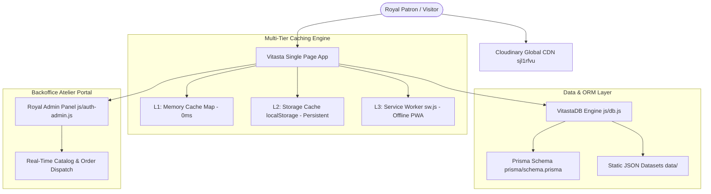

# 👑 Vitasta by Smita Saraswat — Luxury Handcrafted Sarees

<div align="center">

[](https://wa.me/918824017443)
[](https://cloudinary.com)
[](https://github.com/Er-Mayank-Aggarwal/Vitasta)
[](https://github.com/Er-Mayank-Aggarwal/Vitasta)

### *Unfolding Serenity · Inspired by the Royal Queens of Rajasthan*

**A bespoke, high-performance eCommerce web application showcasing 21 handcrafted royal sarees across 5 exclusive collections, backed by multi-tier caching, an Atelier Admin Portal, and a global Cloudinary CDN delivery network.**

[✨ View Catalog](#-the-five-royal-collections) • [🏛️ Brand Story](#️-brand-overview) • [⚡ Architecture](#-system-architecture--caching) • [👤 Patron & Admin Portal](#-patron-account--atelier-admin-portal) • [🚀 Quick Start](#-running-locally)

</div>

---

## 🏛️ Brand Overview

**Vitasta by Smita Saraswat** is an haute couture Indian ethnic luxury label celebrating ancestral Adda embroidery and traditional craftsmanship. Rooted in the blue city of **Jodhpur, Rajasthan**, each royal creation requires between 15 to 30 days of meticulous, unhurried handwork by generational master artisans.

### 🎨 The Royal Design System
* **Royal Sapphire (`#0B3B60`, `#071E3D`)**: Echoing the majestic courtyards and palaces of Jodhpur.
* **Serene Ivory & Pearl (`#FFFFFF`, `#FAF9F6`)**: Graceful drapes, pristine balance, and understated luxury.
* **Marwar Crimson & Gold (`#C1272D`, `#D4AF37`)**: Royal celebration, auspicious heritage, and fine Adda zari.
* **Typography**: *Cinzel* for regal imperial titles paired with *Montserrat* & *Cormorant Garamond* for editorial drapes.

---

## 🌟 Key Features & Highlights

### 1. 👑 5 Royal Collections with 0ms Auto-Slideshow
- **Riwaayat-e-Chiffon**: Pure fluid chiffon sarees adorned with fine Aari-Tari, Cutdana, and Moti jaal.
- **Georgette Reet**: Khaddi and satin georgette drapes with graceful fall and statement hand embroidery.
- **Silk Noorani**: Lustrous Habutai, Dupion, and Satin silk drapes reflecting royal sheen.
- **Organza Adaa**: Delicate sheer organza silk creations highlighting intricate handwork.
- **Banarasi Virasat**: Heritage Banarasi Khaddi Georgette and Meenakari weaves with authentic Adda borders.
- **⚡ Dynamic Image Carousel**: Smooth cross-fading auto-slideshow on collection cards with in-memory pre-decoding and zero layout bar shifts.

### 2. 📜 3 × 7 Royal Saree Catalog (21 Creations)
- **Balanced 3-Column Desktop Grid**: Structured 3×7 matrix offering balanced spacing, rich typography, and tactile hover elevations.
- **Instant Search & Multi-Facet Filtering**: Filter in real-time by fabric (*Chiffon, Georgette, Silk, Organza, Banarasi*), color palette, or artisan handwork (*Aari-Tari, Gota Patti, Zardozi, Cutdana, Pitta*).
- **Multi-Category Sorting**: Price (Low to High / High to Low), Alphabetical, and Featured Collections.
- **Interactive Quick-View Modal**: Multi-angle zoomable thumbnail gallery, fabric composition, blouse details, artisan time investment, and direct 1-click WhatsApp order generation.

### 3. 🛡️ Heritage Craftsmanship & Transparent QC
- **Artisan Technique Showcase**: Step-by-step breakdown of traditional Adda craftsmanship.
- **8-Step Saree Care Guide**: Guidelines for preserving delicate zari, natural dyes, and pure silk fibers.
- **Pre-Dispatch Video Verification**: Every royal patron receives a private 100% transparent inspection video of their finished saree prior to courier dispatch.

### 4. 👤 Patron Account & Atelier Admin Portal
- **Royal Patron Authentication**: Registration, quick login, and password recovery.
- **Patron Portal**:
  - **Live Order Timeline**: 6-stage tracker (*Order Booked* → *Fabric Selection* → *Adda Hand Embroidery* → *Quality Check* → *Pre-Dispatch Video Verification* → *Express Dispatch*).
  - **Printable Royal Invoice**: Generates printable GST-compliant order bills with breakdown and shipping details.
  - **Saved Address Book**: Full coverage across all 36 Indian States and Union Territories.
  - **Shortlist Manager**: Live wishlist with 1-click WhatsApp concierge inquiry.
- **Royal Atelier Admin Panel**:
  - Real-time business telemetry (*Total Sarees, Orders in Production, Inquiries Value, Registered Patrons*).
  - Live Saree Catalog CRUD (Add new creations, update pricing/descriptions, toggle stock).
  - Order pipeline management and courier tracking updates.
  - Database JSON backup export, import, and factory reset.

### 5. 📱 Luxury Mobile Navigation Drawer
- Slide-in luxury navigation drawer with backdrop blur (`backdrop-filter: blur(8px)`).
- Real-time patron status badge, WhatsApp artisan hotline, and smooth touch-scrolling collection chips.
- Fully responsive across desktop (1440px+), tablet (768px - 1024px), and mobile (360px - 480px).

---

## ⚡ System Architecture & Caching



### Multi-Tier Cache Specification
| Tier | Location | Strategy | Expiry / TTL | Purpose |
| :--- | :--- | :--- | :--- | :--- |
| **L1** | In-Memory `Map` | Instant Nanosecond Lookup | 5 Minutes (configurable) | Zero-delay UI transitions & filter changes |
| **L2** | `localStorage` | Stale-While-Revalidate | Persistent across sessions | Offline patron state, cart & catalog |
| **L3** | `ServiceWorker` | Cache-First for static assets | Versioned Cache Bucket | Offline shell & instant page loads |
| **CDN** | Cloudinary Edge | HTTP Immutable Cache-Control | 1 Year (Immutable) | High-fidelity product & brand assets |

---

## 📂 Repository Structure

```
Vitasta/
├── index.html                    # Luxury responsive layout, modals & portal views
├── css/
│   └── style.css                 # 3,000+ lines of custom design tokens & responsive CSS
├── js/
│   ├── data.js                   # 21 royal sarees, 5 collections, & brand specifications
│   ├── app.js                    # Catalog filter engine, auto-slideshow, modals & shortlist
│   ├── auth-admin.js             # Authentication, Patron Portal & Atelier Admin Panel
│   ├── cache.js                  # L1 Memory + L2 Storage Multi-Tier Caching Engine
│   └── db.js                     # Prisma-compatible VitastaDB ORM Layer
├── data/
│   ├── products.json             # 21 sarees with specifications & Cloudinary CDN URLs
│   ├── categories.json           # 5 Royal Saree Collections
│   ├── brand.json                # Brand narratives, policies, and contact information
│   ├── site_data.json            # Consolidated JSON dataset
│   └── cdn_mapping.json          # 1:1 local asset to Cloudinary CDN lookup table
├── prisma/
│   └── schema.prisma             # Relational database schema
├── sw.js                         # Service Worker & Asset Caching Engine
├── batch_upload_cdn.py           # Parallel Cloudinary CDN upload & dataset sync utility
├── upload_to_cloudinary.py       # Cloudinary REST API upload script
├── .gitignore                    # Version control ignore rules (excludes local images/archives)
└── README.md                     # Comprehensive Project Documentation
```

---

## 🚀 Running Locally

The application is built with standard Vanilla web technologies (HTML5, CSS3, ES6+ JavaScript) and has **zero external build dependencies**.

### Quick Start

```powershell
# 1. Clone the repository
git clone https://github.com/Er-Mayank-Aggarwal/Vitasta.git

# 2. Navigate to the project directory
cd Vitasta

# 3. Start a local HTTP server
# Option A: Using Python
python -m http.server 8080

# Option B: Using Node.js
npx serve .
```

Then open your browser and navigate to:
```
http://localhost:8080
```

---

## 🔑 Demo & Admin Credentials

To explore the **Royal Atelier Admin Panel**:
1. Click the **"Royal Atelier"** button in the header (or open via the mobile navigation drawer).
2. Enter the administrator credentials:
   - **Admin Passcode**: `vitasta2026` or `admin123`
3. Access real-time catalog modification, production stage tracking, and database backup exports.

---

## 🏛️ Atelier & Contact Information

<div align="center">

**VITASTA LIFESTYLE**  
*House No. 10A, Kanti, Paota B Road, Near Jalam Niwas*  
*Jodhpur, Rajasthan – 342001, India*

📱 **WhatsApp Concierge**: [+91 88240 17443](https://wa.me/918824017443)  
✉️ **Email**: [vitastabysmita@gmail.com](mailto:vitastabysmita@gmail.com)  
👑 **Founder & Creative Director**: Smita Saraswat  

---

*Handcrafted with Royal Heritage in Jodhpur, Rajasthan.*

</div>
