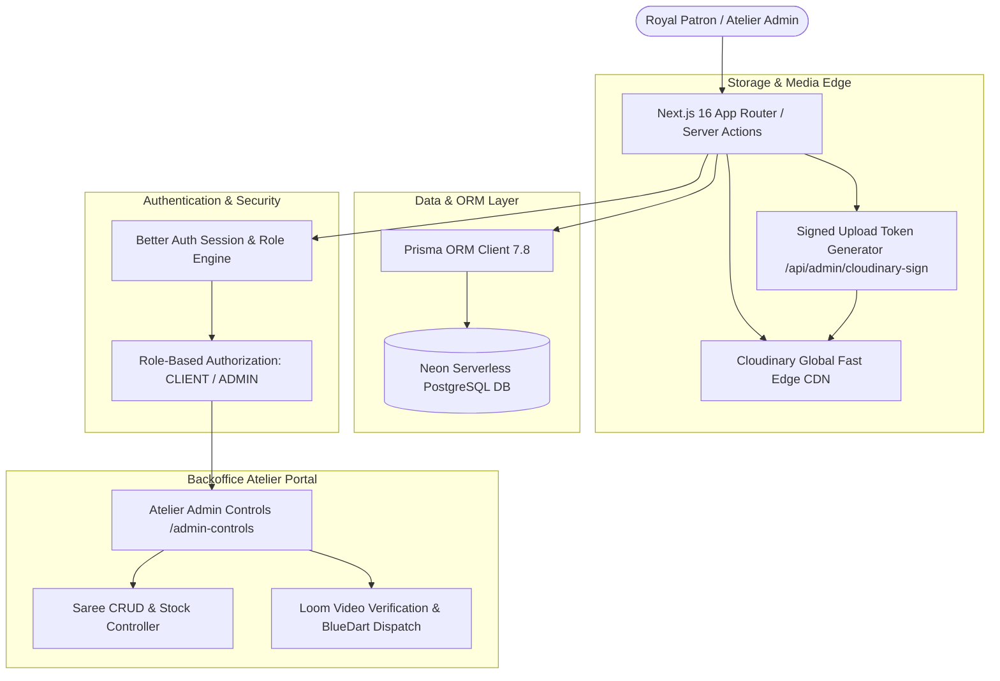

# 👑 Vitasta by Smita Saraswat — Luxury Handcrafted Sarees

<div align="center">

[](https://wa.me/918824017443)
[-000000.svg?style=for-the-badge&logo=nextdotjs&logoColor=white)](https://nextjs.org)
[](https://neon.tech)
[](https://prisma.io)
[](https://cloudinary.com)
[](https://github.com/Er-Mayank-Aggarwal/Vitasta)

### *Unfolding Serenity · Inspired by the Royal Queens of Rajasthan*

**An haute couture Indian ethnic luxury web application showcasing 21 handcrafted royal sarees across 5 exclusive collections, backed by Next.js 16 App Router, Neon Serverless PostgreSQL, Better Auth, an Atelier Admin Management Portal, and Signed Cloudinary Edge Media Delivery.**

[✨ View Catalog](#-the-five-royal-collections) • [🏛️ Brand Story](#️-brand-overview) • [⚡ Architecture](#-system-architecture--data-flow) • [👤 Patron & Admin Portal](#-patron-account--atelier-admin-portal) • [🚀 Quick Start](#-running-locally) • [📖 API Docs](#-interactive-api-docs)

</div>

---

## 🏛️ Brand Overview

**Vitasta by Smita Saraswat** is an haute couture Indian ethnic luxury label celebrating ancestral Adda embroidery and traditional craftsmanship. Rooted in the blue city of **Jodhpur, Rajasthan**, each royal creation requires between 15 to 30 days of meticulous, unhurried handwork by generational master artisans.

### 🎨 The Royal Design System
* **Royal Sapphire (`#0B3B60`, `#071E3D`)**: Echoing the majestic courtyards and palaces of Jodhpur.
* **Serene Ivory & Pearl (`#FFFFFF`, `#FAF9F6`)**: Graceful drapes, pristine balance, and understated luxury.
* **Marwar Crimson & Gold (`#C1272D`, `#D4AF37`)**: Royal celebration, auspicious heritage, and fine Adda zari.
* **Typography**: *Playfair Display* / *Cinzel* for regal imperial titles paired with *Inter* / *Montserrat* for crisp, modern editorial drapes.

---

## 🌟 Key Features & Highlights

### 1. 👑 5 Royal Collections with Instant Dynamic Slideshow
- **Riwaayat-e-Chiffon**: Pure fluid chiffon sarees adorned with fine Aari-Tari, Cutdana, and Moti jaal.
- **Georgette Reet**: Khaddi and satin georgette drapes with graceful fall and statement hand embroidery.
- **Silk Noorani**: Lustrous Habutai, Dupion, and Satin silk drapes reflecting royal sheen.
- **Organza Adaa**: Delicate sheer organza silk creations highlighting intricate handwork.
- **Banarasi Virasat**: Heritage Banarasi Khaddi Georgette and Meenakari weaves with authentic Adda borders.

### 2. 📜 3 × 7 Royal Saree Catalog (21 Creations)
- **Balanced 3-Column Desktop Grid**: Structured matrix offering balanced spacing, rich typography, and tactile hover elevations.
- **Instant Search & Multi-Facet Filtering**: Filter in real-time by fabric (*Chiffon, Georgette, Silk, Organza, Banarasi*), color palette, or artisan handwork (*Aari-Tari, Gota Patti, Zardozi, Cutdana, Pitta*).
- **Multi-Category Sorting**: Price (Low to High / High to Low), Alphabetical, and Featured Collections.
- **Interactive Quick-View Modal**: Multi-angle zoomable thumbnail gallery, fabric composition, blouse details, artisan time investment, and direct 1-click WhatsApp order generation.

### 3. 🛍️ Bag, Checkout & Atomic Inventory Locks
- **Sliding Cart Drawer**: Real-time quantity adjustment, stock limit enforcement, and dynamic totals.
- **Discount & Coupon Engine**: Automated coupon validation (`ROYAL10`, etc.) with instant price recalculation.
- **Bespoke Checkout**: Address book integration with full coverage across all 36 Indian States and Union Territories.
- **Atomic PostgreSQL Transactions**: Concurrency-safe stock reservations and order number generation (`VSA-XXXXXX-XXX`).

### 4. 👤 Patron Portal & Printable Royal Invoice
- **Better Auth Authentication**: Secure patron registration, session cookies, and role-based permissions (`CLIENT`, `ADMIN`, `OWNER`).
- **Live 6-Stage Order Timeline Tracker**:
  *Order Booked* → *Fabric Selection* → *Adda Hand Embroidery* → *Quality Check* → *Pre-Dispatch Video Verification* → *Express Dispatch*.
- **Printable Royal Invoice**: Generates sovereign, GST-compliant order bills with breakdown, item imagery, and BlueDart tracking details (`/invoice/[orderId]`).

### 5. 🛡️ Royal Atelier Admin Backoffice (`/admin-controls`)
- **Telemetry & KPI Dashboard**: Real-time monitoring of total revenue, active orders, patrons, low-stock alerts, and concierge messages.
- **Saree Catalog CRUD with Direct Media Drag-and-Drop Uploader**:
  - Signed Cloudinary direct upload integration for primary drape images and multi-angle gallery photos.
  - Manual CDN URL input toggle for maximum flexibility.
- **Order Pipeline & Loom Video Verification**:
  - Live status transitions, courier partner updates, and direct drag-and-drop MP4 loom inspection video attachments.
- **Stock & Inventory Controller**: Real-time quantity updates, reserved stock tracking, and threshold adjustments.
- **Patron Directory & Tier Management**: Royal Patron / VIP patron directory with order metrics.
- **Coupon Manager**: Create percentage/fixed discount codes with expiry and usage limits.
- **Concierge Inquiries & Subscribers**: View and manage customer inquiries and newsletter subscriptions.

---

## ⚡ System Architecture & Data Flow


```mermaid
graph TD
    Client([Royal Patron / Atelier Admin]) --> NextApp[Next.js 16 App Router / Server Actions]
    
    subgraph Storage & Media Edge
        NextApp --> CloudinaryCDN[Cloudinary Global Fast Edge CDN]
        NextApp --> SignAPI[Signed Upload Token Generator /api/admin/cloudinary-sign]
        SignAPI --> CloudinaryCDN
    end
    
    subgraph Data & ORM Layer
        NextApp --> PrismaORM[Prisma ORM Client 7.8]
        PrismaORM --> NeonDB[(Neon Serverless PostgreSQL DB)]
    end
    
    subgraph Authentication & Security
        NextApp --> BetterAuth[Better Auth Session & Role Engine]
        BetterAuth --> RBAC[Role-Based Authorization: CLIENT / ADMIN]
    end
    
    subgraph Backoffice Atelier Portal
        RBAC --> AdminUI[Atelier Admin Controls /admin-controls]
        AdminUI --> CatalogCRUD[Saree CRUD & Stock Controller]
        AdminUI --> OrderPipeline[Loom Video Verification & BlueDart Dispatch]
    end
```

---

## 📂 Repository Structure

```
Vitasta/
├── app/
│   ├── actions/                  # Next.js Server Actions (Product, Checkout, Admin, User, Inventory)
│   ├── admin-controls/           # Royal Atelier Admin Console (Products, Orders, Inventory, Coupons)
│   ├── api/                      # REST & Better Auth API Routes + OpenAPI Spec
│   │   ├── admin/                # Signed Cloudinary upload token & server stream proxy
│   │   ├── auth/                 # Better Auth session & authentication endpoints
│   │   └── docs/                 # OpenAPI 3.0 specification endpoint
│   ├── api-docs/                 # Interactive Swagger UI API documentation
│   ├── components/               # Reusable luxury UI components (Header, Footer, MediaUploader, AuthForm)
│   ├── context/                  # React CartContext state provider
│   ├── invoice/                  # Printable GST-compliant Sovereign Invoice views
│   ├── product/                  # Dynamic Saree Detail page with Adda specs & zoom gallery
│   ├── shop/                     # Filterable & sortable 3x7 Saree Catalog
│   ├── globals.css               # Design tokens, typography & luxury animations
│   ├── layout.js                 # Root layout with OpenGraph & NextTopLoader
│   └── page.js                   # Homepage with Hero drape & Royal Collections
├── data/                         # Static catalog datasets & Cloudinary CDN lookup tables
│   ├── products.json             # 21 royal sarees with detailed specifications
│   ├── categories.json           # 5 Royal Collections
│   ├── brand.json                # Brand narratives, origin, and contact details
│   └── cdn_mapping.json          # 1:1 asset to Cloudinary CDN lookup
├── lib/                          # Core backend utilities (Prisma Client, Better Auth, Validations, RBAC)
├── prisma/
│   ├── schema.prisma             # PostgreSQL database relational schema
│   └── seed.mjs                  # Database seeder script
├── test_endpoints.mjs            # Automated verification test suite for all routes
├── .env                          # Environment variables (Neon DB, Better Auth, Cloudinary)
├── .gitignore                    # Version control ignore rules
├── next.config.mjs               # Next.js configuration & image remote patterns
├── package.json                  # Dependencies & execution scripts
└── README.md                     # Comprehensive Project Documentation
```

---

## 🚀 Running Locally

### Prerequisites
* **Node.js**: v18.17+ or v20+ / v22+
* **npm** or **pnpm** / **yarn**

### Quick Start

```powershell
# 1. Clone the repository
git clone https://github.com/Er-Mayank-Aggarwal/Vitasta.git

# 2. Navigate to the project directory
cd Vitasta

# 3. Install dependencies
npm install

# 4. Generate Prisma Client & Run DB Seed (Optional)
npm run build # or npx prisma generate

# 5. Start the development server
npm run dev
```

Then open your browser and navigate to:
```
http://localhost:3000
```

---

## 📖 Interactive API Docs

Explore and test the complete REST API specification directly in your browser:
* **Interactive Swagger UI**: [http://localhost:3000/api-docs](http://localhost:3000/api-docs)
* **OpenAPI 3.0 JSON Spec**: [http://localhost:3000/api/docs/spec](http://localhost:3000/api/docs/spec)

---

## 🔑 Demo & Admin Credentials

To explore the **Royal Atelier Admin Backoffice**:
1. Navigate to [http://localhost:3000/admin-controls](http://localhost:3000/admin-controls).
2. Click **"Atelier Admin"** on the 1-Click Demo Login panel (or sign in with admin email).
3. Access real-time catalog editing, direct Cloudinary drag-and-drop media uploads, order status pipeline updates, and inventory tracking.

---

## 🏛️ Atelier & Contact Information

<div align="center">

**VITASTA LIFESTYLE**  
*House No. 10A, Kanti, Paota B Road, Near Jalam Niwas*  
*Jodhpur, Rajasthan – 342001, India*

📱 **WhatsApp Concierge**: [+91 88240 17443](https://wa.me/918824017443)  
✉️ **Email**: [vitastabysmita@gmail.com](mailto:vitastabysmita@gmail.com)  
👑 **Founder & Creative Director**: Smita Saraswat  

---

*Handcrafted with Royal Heritage in Jodhpur, Rajasthan.*

</div>
